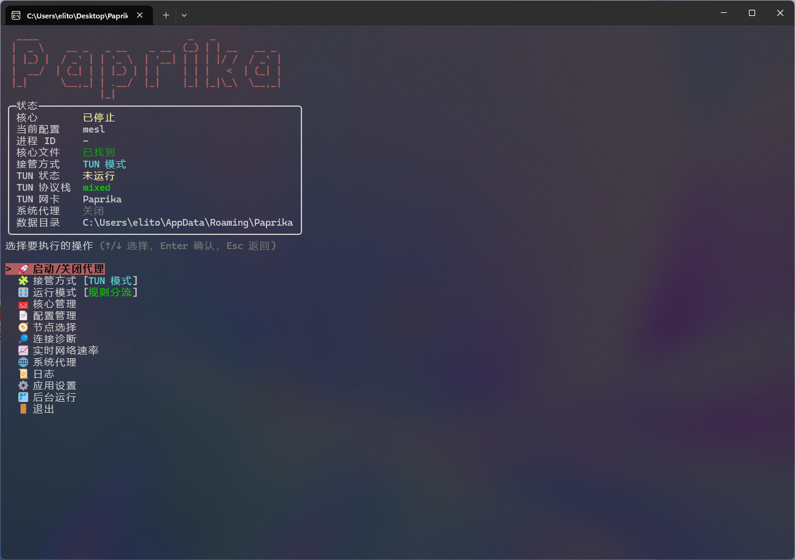
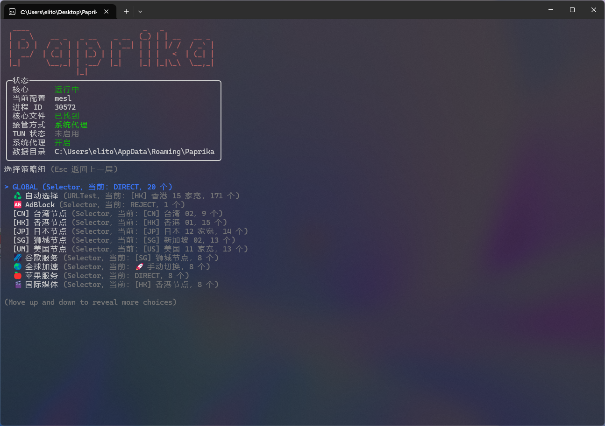
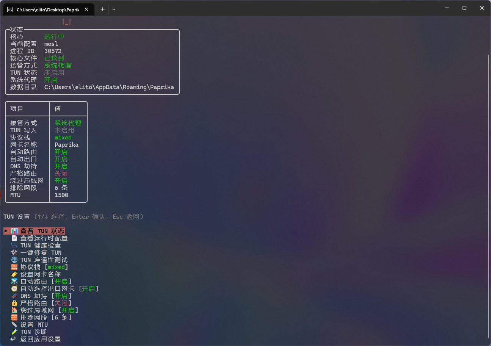
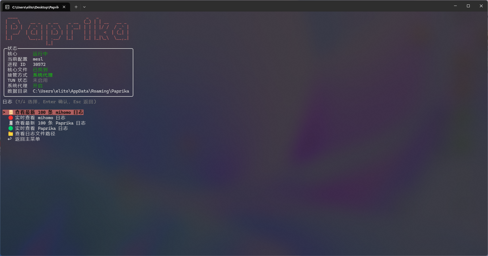
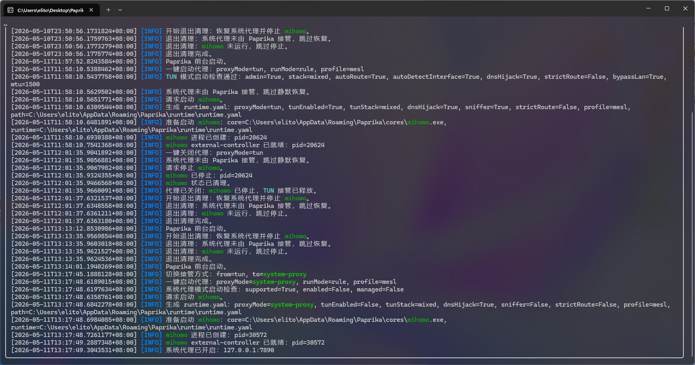

# Paprika

Paprika 是一个基于 .NET 和 [mihomo](https://github.com/MetaCubeX/mihomo) 内核的控制台代理管理工具。界面使用 [Spectre.Console](https://spectreconsole.net/) 构建，目标是在不引入桌面 GUI 的前提下，提供一个可以双击运行、用键盘菜单操作的代理工具。

当前项目仍处于早期开发阶段，功能以 Windows 桌面环境为主要目标。

## 功能特性

- 一键启动/关闭代理
- 自动下载/更新 mihomo 核心
- 本地配置导入
- 订阅链接导入与更新
- 配置切换
- 策略组与节点选择
- 切换节点后自动关闭连接
- 系统代理开关
- 系统代理排除域名管理
- TUN 模式
- TUN 健康检查与一键修复
- TUN 连通性测试
- TUN 运行时配置预览
- TUN 排除网段管理
- 当前连接查看、搜索、关闭
- mihomo 日志与 Paprika 应用日志查看
- 后台运行：退出前台但保留核心和代理运行
- 正常退出时自动关闭核心并恢复代理状态

## 环境要求

- Windows 10/11
- .NET SDK 10.0 或更新版本
- TUN 模式需要管理员权限运行

Paprika 会把运行数据保存在用户目录下：

```text
%APPDATA%\Paprika
```

常见子目录：

```text
cores      mihomo 核心
profiles   用户配置
runtime    Paprika 生成的运行时配置
logs       mihomo 和 Paprika 日志
```

## 运行

克隆仓库后进入项目目录：

```powershell
git clone https://github.com/meowioo/Paprika.git
cd Paprika
dotnet run --project Paprika/Paprika.csproj
```

或直接构建：

```powershell
dotnet build Paprika.sln
```

发布单文件 exe 示例：

```powershell
dotnet publish Paprika/Paprika.csproj -c Release -r win-x64 --self-contained true /p:PublishSingleFile=true
```

## 基本使用流程

1. 启动 Paprika。
2. 进入 `核心管理`，选择 `下载/更新核心`。
3. 进入 `配置管理`，导入本地配置或订阅链接。
4. 在主菜单选择 `启动/关闭代理`。
5. 需要切换节点时，进入 `节点选择`。

## TUN 模式说明

TUN 模式会通过 mihomo 创建虚拟网卡接管系统流量。使用前请注意：

- 需要以管理员身份运行 Paprika。
- TUN 模式下一般不需要再开启 Windows 系统代理。
- 如果网络异常，可以进入 `应用设置 -> TUN 设置`：
  - `TUN 健康检查`
  - `一键修复 TUN`
  - `TUN 连通性测试`
  - `查看运行时配置`
- 排除网段可用于绕过局域网、NAS、WSL、Docker、Hyper-V、公司内网等地址段。

## 示例配置

仓库包含一个最小示例配置：

```text
samples/minimal-profile.yaml
```

真实使用时请导入自己的 mihomo 配置或订阅链接。

## 开发说明

项目结构：

```text
Paprika/
  Models/      数据模型
  Services/    核心、配置、API、系统代理等服务
  Ui/          Spectre.Console 交互界面
samples/       示例配置
```

## 运行截图







## 免责声明

Paprika 只是 mihomo 的本地控制台管理工具，不提供代理服务、节点或订阅内容。请遵守所在地法律法规，并自行承担使用第三方配置、订阅和网络服务带来的风险。
